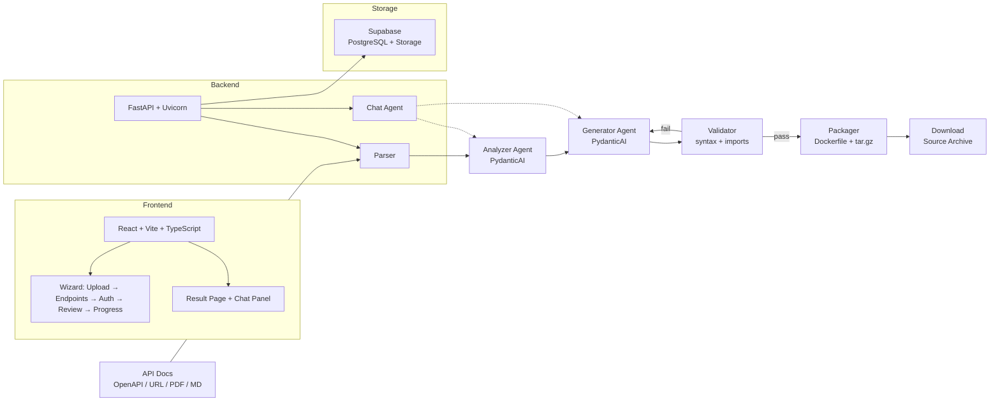

# mcpgen

**Generate production-ready MCP servers from API documentation.**

[](https://www.python.org/downloads/)
[](https://fastapi.tiangolo.com/)
[](https://ai.pydantic.dev/)
[](https://github.com/jlowin/fastmcp)
[](https://react.dev/)
[](LICENSE)

## What it does

- **Accepts any API documentation** -- OpenAPI/Swagger specs, URLs, PDFs, or Markdown files
- **AI-powered analysis and code generation** -- PydanticAI agents produce optimized MCP tool names, descriptions, and fully functional Python server code
- **Delivers a ready-to-run package** -- downloadable source archive with Dockerfile, README, and environment configuration

## How it works

```
Upload → Analyze → Generate → Validate → Package
```

1. **Upload** -- provide an OpenAPI spec, URL, PDF, or Markdown file
2. **Analyze** -- AI agent extracts endpoints, infers auth patterns, and generates LLM-optimized tool descriptions
3. **Generate** -- AI agent produces a complete FastMCP Python server with Streamable HTTP transport
4. **Validate** -- automated syntax checks, import verification, and retry on failure
5. **Package** -- source archive (.tar.gz) with Dockerfile, README, and .env.example

## Quick start

### Prerequisites

- Python 3.12+
- Node.js 18+ (frontend)
- Docker (optional, for containerized runs)
- OpenRouter API key

### Setup

```bash
git clone https://github.com/your-org/mcpgen.git
cd mcpgen

# Backend
cp .env.example .env
# Fill in SUPABASE_URL, SUPABASE_KEY, OPENROUTER_API_KEY
pip install -e ".[dev]"
cd backend && uvicorn main:app --reload --port 8000

# Frontend
cd frontend && npm install && npm run dev

# Full stack
docker-compose up
```

### Run tests

```bash
python -m pytest tests/ -v
```

## Architecture



## Tech stack

| Layer | Technology |
|-------|-----------|
| Backend | Python 3.12+, FastAPI, uvicorn |
| AI Agents | PydanticAI with OpenRouter |
| MCP Framework | FastMCP v3.1 (Streamable HTTP) |
| Database | Supabase (PostgreSQL + Storage) |
| Frontend | React + Vite + TypeScript |
| Parsing | prance, openapi-pydantic, pdfplumber, trafilatura |
| AI Testing | deepeval (LLM-as-judge) |
| Packaging | docker-py, tar.gz source archives |

## API reference

See [docs/api.md](docs/api.md) for the full API reference.

Key endpoints:

- `POST /api/specs/upload` -- upload OpenAPI spec
- `POST /api/specs/from-url` -- fetch and parse from URL
- `POST /api/jobs/{id}/configure` -- configure generation
- `POST /api/jobs/{id}/generate` -- start code generation
- `GET /api/jobs/{id}/artifacts/source` -- download source archive
- `POST /api/jobs/{id}/chat` -- AI chat assistant

## Quality

18 quality metrics are tracked across the pipeline:

- Parser: spec validation, endpoint extraction accuracy, auth detection
- Analyzer: tool naming (snake_case), description quality (LLM-as-judge), parameter mapping
- Generator: syntax validity, import correctness, MCP compliance, auth handling
- Packager: Dockerfile correctness, archive completeness, README generation
- End-to-end: full pipeline success rate, output server functionality

## Screenshots

<!-- TODO: Add screenshots of the wizard flow and result page -->

## Project structure

```
mcpgen/
├── backend/
│   ├── main.py              # FastAPI app
│   ├── config.py            # pydantic-settings
│   ├── api/                 # FastAPI routes
│   ├── pipeline/            # Parse → Analyze → Generate → Validate → Package
│   ├── agents/              # PydanticAI agents + Pydantic output models
│   ├── codegen/             # Jinja2 templates, auth snippets, Dockerfile template
│   ├── db/                  # Supabase client, models, repositories
│   └── services/            # Docker, storage, spec fetcher services
├── frontend/src/
│   ├── pages/               # HomePage, WizardPage, ResultPage
│   ├── components/          # wizard/, chat/, common/
│   ├── hooks/               # useJob, useChat
│   └── api/                 # Backend API client
├── docs/                    # Architecture documentation
└── tests/                   # pytest + deepeval
```

## License

MIT
