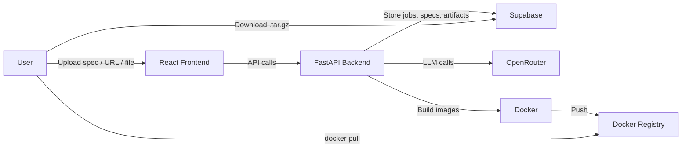
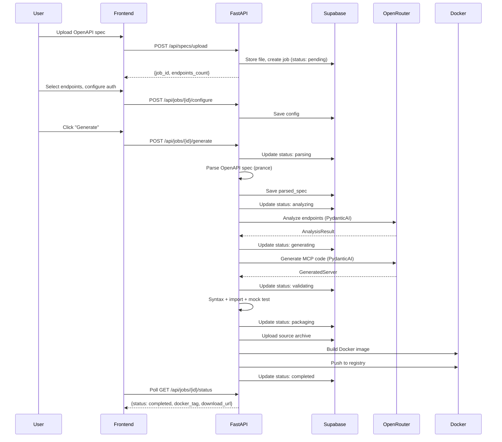

# Architecture

## System Overview

mcpgen is a web application that generates MCP (Model Context Protocol) servers from API documentation. It combines AI-powered analysis with code generation to produce production-ready Docker containers.

## High-Level Flow

## Components

### Frontend (React + Vite)
- **WizardPage**: 5-step flow (Upload → Select Endpoints → Auth → Review → Progress)
- **ChatPanel**: Floating AI assistant for clarifications during wizard steps 2-4
- **ResultPage**: Docker pull command + source download

### Backend (FastAPI)
- **API layer** (`backend/api/`): REST endpoints for jobs, specs, generation, artifacts, chat
- **Pipeline** (`backend/pipeline/`): Orchestrated 5-stage generation pipeline
- **Agents** (`backend/agents/`): PydanticAI agents (analyzer, generator, chat)
- **Codegen** (`backend/codegen/`): Jinja2 templates for MCP server scaffolding
- **Services** (`backend/services/`): Docker, Supabase Storage, URL fetching

### External Services
- **Supabase**: PostgreSQL (jobs, specs, generated servers, chat) + Storage (file uploads, artifacts)
- **OpenRouter**: LLM provider (dev: DeepSeek V3.2, prod: Claude Sonnet 4.6)
- **Docker**: Programmatic image builds via docker-py

## Data Flow

## Technology Choices

| Component | Technology | Rationale |
|-----------|-----------|-----------|
| AI Framework | PydanticAI | Best structured outputs, native OpenRouter, type-safe |
| MCP Framework | FastMCP v3.1 | Python-native, Streamable HTTP transport |
| LLM Provider | OpenRouter | Multi-model, cost-effective (free dev models) |
| Transport | Streamable HTTP | SSE deprecated in MCP spec 2025-03-26 |
| Backend | FastAPI | Async, Pydantic-native, matches PydanticAI ecosystem |
| Database | Supabase | PostgreSQL + Storage + Auth (future) in one |
| Frontend | React + Vite | Minimal, fast, TypeScript |
