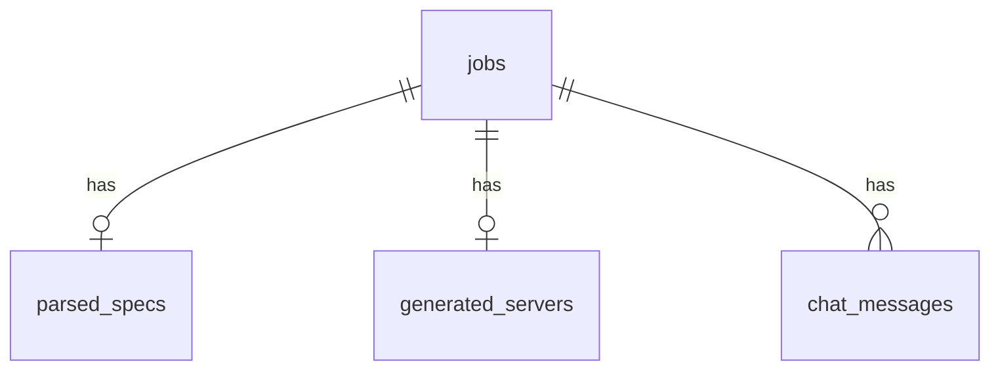

# Database Schema

Supabase (PostgreSQL) with 4 tables and 2 storage buckets.

## Tables

### jobs
Tracks each generation request end-to-end.

```sql
CREATE TABLE jobs (
    id UUID PRIMARY KEY DEFAULT gen_random_uuid(),
    status TEXT NOT NULL DEFAULT 'pending'
        CHECK (status IN ('pending', 'parsing', 'analyzing', 'generating', 'validating', 'packaging', 'completed', 'failed')),
    error_message TEXT,
    input_type TEXT NOT NULL
        CHECK (input_type IN ('openapi_json', 'openapi_yaml', 'url', 'file_upload')),
    input_ref TEXT NOT NULL,
    config JSONB,
    docker_image_tag TEXT,
    source_archive_path TEXT,
    created_at TIMESTAMPTZ NOT NULL DEFAULT now(),
    updated_at TIMESTAMPTZ NOT NULL DEFAULT now()
);

CREATE INDEX idx_jobs_status ON jobs(status);
```

### parsed_specs
Normalized API structure after parsing.

```sql
CREATE TABLE parsed_specs (
    id UUID PRIMARY KEY DEFAULT gen_random_uuid(),
    job_id UUID NOT NULL REFERENCES jobs(id) ON DELETE CASCADE,
    title TEXT,
    base_url TEXT,
    auth_schemes JSONB,
    endpoints JSONB NOT NULL,
    raw_spec JSONB,
    created_at TIMESTAMPTZ NOT NULL DEFAULT now()
);

CREATE INDEX idx_parsed_specs_job_id ON parsed_specs(job_id);
```

### generated_servers
Generated code artifacts.

```sql
CREATE TABLE generated_servers (
    id UUID PRIMARY KEY DEFAULT gen_random_uuid(),
    job_id UUID NOT NULL REFERENCES jobs(id) ON DELETE CASCADE,
    server_code TEXT NOT NULL,
    requirements_txt TEXT NOT NULL,
    dockerfile TEXT NOT NULL,
    tool_manifest JSONB,
    validation_result JSONB,
    created_at TIMESTAMPTZ NOT NULL DEFAULT now()
);

CREATE INDEX idx_generated_servers_job_id ON generated_servers(job_id);
```

### chat_messages
Conversation between user and AI during generation.

```sql
CREATE TABLE chat_messages (
    id UUID PRIMARY KEY DEFAULT gen_random_uuid(),
    job_id UUID NOT NULL REFERENCES jobs(id) ON DELETE CASCADE,
    role TEXT NOT NULL CHECK (role IN ('user', 'assistant')),
    content TEXT NOT NULL,
    created_at TIMESTAMPTZ NOT NULL DEFAULT now()
);

CREATE INDEX idx_chat_messages_job_id ON chat_messages(job_id);
```

## Auto-update trigger

```sql
CREATE OR REPLACE FUNCTION update_updated_at()
RETURNS TRIGGER AS $$
BEGIN
    NEW.updated_at = now();
    RETURN NEW;
END;
$$ LANGUAGE plpgsql;

CREATE TRIGGER jobs_updated_at
    BEFORE UPDATE ON jobs
    FOR EACH ROW EXECUTE FUNCTION update_updated_at();
```

## Storage Buckets

| Bucket | Purpose | File types |
|--------|---------|------------|
| `specs` | Uploaded API spec files | .json, .yaml, .yml, .pdf, .md |
| `artifacts` | Generated source archives | .tar.gz |

## Relationships


