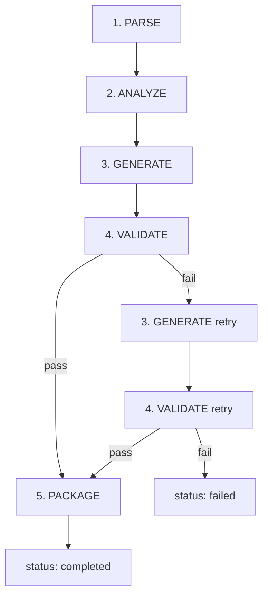

# AI Pipeline

5-stage sequential pipeline with conditional retry. Each stage updates `jobs.status` in Supabase.

## Pipeline Overview



## Stage 1: PARSE

**File**: `backend/pipeline/parser.py`
**Input**: Raw file/URL from Supabase Storage
**Output**: `ParsedSpec` saved to `parsed_specs` table

Handles three input types:
1. **OpenAPI JSON/YAML**: Parse with prance ($ref resolution) + openapi-pydantic (typed access)
2. **URL**: Fetch with httpx. If JSON/YAML → parse as OpenAPI. If HTML → extract with trafilatura → LLM-assisted endpoint extraction
3. **File upload**: PDF (pdfplumber) or Markdown → LLM-assisted endpoint extraction

## Stage 2: ANALYZE

**File**: `backend/agents/analyzer_agent.py`
**Input**: Selected endpoints from `parsed_specs` + auth schemes
**Output**: `AnalysisResult` (Pydantic model)

PydanticAI agent with `result_type=AnalysisResult`:
- Groups endpoints logically (by tag/resource)
- Generates LLM-optimized tool names (snake_case)
- Writes tool descriptions using "Use when:" pattern
- Recommends auth strategy based on detected schemes
- Flags potential issues (rate limits, destructive endpoints)

### AnalysisResult Model

```python
class ToolParameter(BaseModel):
    name: str
    type: str           # "string", "integer", "boolean", "object", "array"
    description: str
    required: bool

class ToolDefinition(BaseModel):
    tool_name: str      # snake_case: "list_users"
    description: str    # LLM-optimized, 1-3 sentences
    group: str          # "users", "billing"
    http_method: str
    path: str
    parameters: list[ToolParameter]
    request_body_schema: dict | None
    response_description: str

class AnalysisResult(BaseModel):
    server_name: str
    server_description: str
    tools: list[ToolDefinition]
    auth_recommendation: str
    notes: list[str]
```

## Stage 3: GENERATE

**File**: `backend/agents/generator_agent.py`
**Input**: `AnalysisResult` + auth config from job
**Output**: `GeneratedServer` (Pydantic model)

PydanticAI agent with `result_type=GeneratedServer`:
- Generates complete FastMCP v3.1 server Python code
- Uses Streamable HTTP transport
- Each tool uses httpx for async HTTP calls
- Auth credentials from environment variables
- Includes health check tool
- Handles pagination where applicable

### GeneratedServer Model

```python
class GeneratedFile(BaseModel):
    filename: str
    content: str
    description: str

class GeneratedServer(BaseModel):
    files: list[GeneratedFile]
    requirements: list[str]
    env_vars: list[str]
    startup_command: str
```

## Stage 4: VALIDATE

**File**: `backend/pipeline/validator.py`
**Input**: `GeneratedServer`
**Output**: `ValidationResult`

Three-phase validation:
1. **Syntax check**: `compile()` each .py file — catches SyntaxError
2. **Import check**: Write to temp dir, run `python -c "import server"` in subprocess
3. **Mock test**: Instantiate FastMCP server, call `list_tools()`, verify tool count matches

If validation fails → retry generation once (Stage 3) with error feedback in prompt.
If retry also fails → `status: failed` with error details.

## Stage 5: PACKAGE

**File**: `backend/pipeline/packager.py`
**Input**: `GeneratedServer` (validated)
**Output**: Docker image + source archive

1. Create `.tar.gz` archive: server.py, requirements.txt, Dockerfile, .env.example, README.md
2. Upload archive to Supabase Storage (`artifacts` bucket)
3. Write files to temp dir
4. Build Docker image via docker-py
5. Push to configured registry (if enabled)
6. Update job: `status: completed`, `docker_image_tag`, `source_archive_path`

## Chat Agent

**File**: `backend/agents/chat_agent.py`
**Operates**: During wizard steps 2-4 (not part of pipeline)

Conversational agent that helps users:
- Understand what endpoints do
- Decide which endpoints to include/exclude
- Choose auth strategy
- Provides `config_updates` suggestions that the frontend can apply to wizard state

## AI Testing (deepeval)

Agent outputs are tested with deepeval LLM-as-judge:
- **AnalysisResult**: tool descriptions are clear and actionable
- **GeneratedServer**: code is valid, follows FastMCP patterns, handles errors
- **ChatSuggestion**: responses are relevant and helpful
